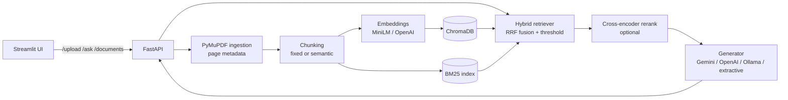

# 📄 RAG Document Assistant

Ask questions about your PDFs and get answers grounded in the text, with page-level citations.

- **Hybrid retrieval**: ChromaDB vector search + BM25 keyword search, fused with weighted Reciprocal Rank Fusion
- **Optional cross-encoder reranker** (`cross-encoder/ms-marco-MiniLM-L-6-v2`)
- **Verifiable citations**: the LLM cites numbered sources `[S1]`; code maps them to `[filename, p. X]`; invented labels are dropped; nothing is auto-attached
- **Honest refusals**: no relevant chunks, or the model says the sources lack the answer → *"I couldn't find this in the documents."*
- **FastAPI** backend + **Streamlit** UI, multi-PDF upload, per-document filtering
- Works offline with no API key (extractive mode); use a free Gemini key for real answers

## Architecture



## Quickstart (Windows PowerShell)

```powershell
cd rag-document-assistant
python -m venv .venv
.venv\Scripts\Activate.ps1
pip install -r requirements.txt
copy .env.example .env
```

**Get good answers for free:** create a key at https://aistudio.google.com/apikey and put it in `.env`:

```ini
GEMINI_API_KEY=your-key-here
```

`LLM_PROVIDER=auto` then uses Gemini. Without any key it falls back to offline *extractive* mode
(returns the best-matching sentences with exact citations, but is weak at refusing off-topic questions).
You can also use `LLM_PROVIDER=ollama` (local) or `openai`.

Run the two processes in two terminals:

```powershell
uvicorn app.api:app --port 8000          # backend (API docs at http://localhost:8000/docs)
streamlit run ui/streamlit_app.py        # UI at http://localhost:8501
```

The first run downloads the embedding model (~90 MB).

## API examples

```bash
curl -X POST http://127.0.0.1:8000/upload -F "files=@data/sample/enterprise_security_policy.pdf"

curl -X POST http://127.0.0.1:8000/ask -H "Content-Type: application/json" \
  -d '{"question":"How long does an account lockout last?","retrieval_mode":"hybrid","top_k":4}'

curl http://127.0.0.1:8000/documents
curl -X DELETE http://127.0.0.1:8000/documents/<doc_id>
```

`/ask` accepts `retrieval_mode` (`hybrid|vector|bm25`), `alpha`, `top_k`, `rerank`, and `doc_ids` (search only these documents).
The response includes `answer`, `citations`, `sources`, `is_grounded`, `refused`, `provider`.

## Design decisions

| Topic | Decision | Why |
|---|---|---|
| Fusion | Weighted RRF (`alpha` = vector weight) | Rank-based, so scores from BM25 and cosine don't need to be comparable |
| Relevance gate | Threshold on **absolute cosine** (or reranker score) | Per-query normalised scores always make the top hit look perfect |
| Reranker | Cross-encoder, optional | Re-scoring with the same bi-encoder embeddings adds almost nothing |
| Citations | Model cites `[S#]`, code resolves them | Prevents attaching a citation to an answer that didn't come from it |
| Broad questions | "what is this about / summarize" use the opening pages | Such questions match no single chunk well |
| Endpoints | Sync `def` | Blocking model calls run in FastAPI's thread pool instead of freezing the event loop |

## Evaluation

`eval/evaluate.py` runs an ablation (vector, BM25, hybrid, optionally hybrid + cross-encoder) on `eval/qa_pairs.json`
(20 answerable + 8 unanswerable questions, two of them deliberately tricky). Only one setting changes per row, models
are warmed up before timing, and every percentage is printed with its count.

```powershell
python eval/evaluate.py                    # retrieval metrics (Recall@k, MRR, threshold behaviour, latency)
python eval/evaluate.py --rerank           # add the cross-encoder variant
python eval/evaluate.py --with-llm --delay 4   # also grade full answers with your configured LLM
```

**Results:** _run the commands above on your machine and paste the table here._
Report the numbers you actually get. With 28 questions, a one-question difference is 3.6 points, so treat
small gaps as noise, and add more questions (and a longer PDF via `--pdf`) before drawing conclusions.

## Tests

```powershell
pytest tests -v
```

Tests use an offline hashing embedder, so they need no model download. They cover ingestion errors, both chunkers,
all retrieval modes, document filtering, persistence, the reranker path, citation resolution, refusals, and every API endpoint.

## Limitations

- Scanned PDFs (images only) are rejected; there is no OCR.
- The BM25 index lives in memory and is rebuilt on each upload/delete, which is fine for hundreds of pages, not millions.
- Offline extractive mode cannot reliably tell that a question is off-topic; use Gemini/OpenAI/Ollama for that.
- No authentication on the API; add it before exposing the server publicly.

## Deploy

**Docker (backend + UI in one container):**
```bash
docker build -t rag-document-assistant .
docker run -p 8000:8000 -p 8501:8501 --env-file .env rag-document-assistant
```

**Hugging Face Space (Docker SDK):** the Space must run both processes, because the UI calls the API. Expose port 7860
for Streamlit (`streamlit run ui/streamlit_app.py --server.port 7860 --server.address 0.0.0.0`), start `uvicorn` on 8000 in
the same container, and add `GEMINI_API_KEY` under *Settings → Secrets*. A Streamlit-only Space will not work.

## Project structure

```
app/        api.py, config.py, ingestion.py, chunking.py, embeddings.py, retrieval.py, generation.py, rag.py
ui/         streamlit_app.py
eval/       evaluate.py, qa_pairs.json
tests/      ingestion/chunking, retrieval, generation, API
data/sample generate_sample_pdf.py, enterprise_security_policy.pdf
```
